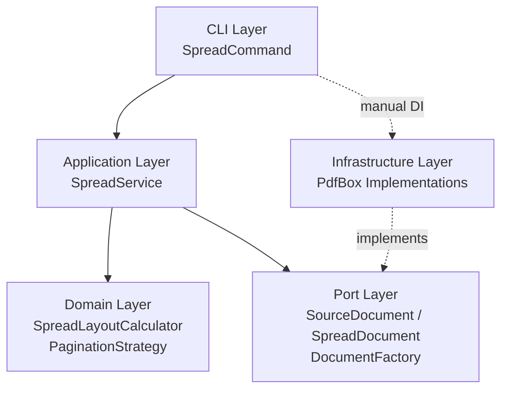
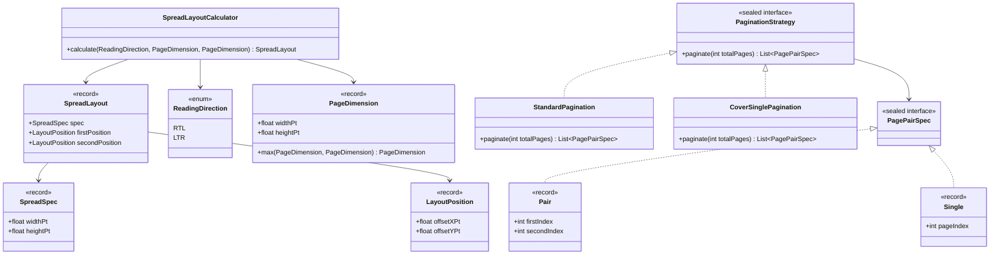
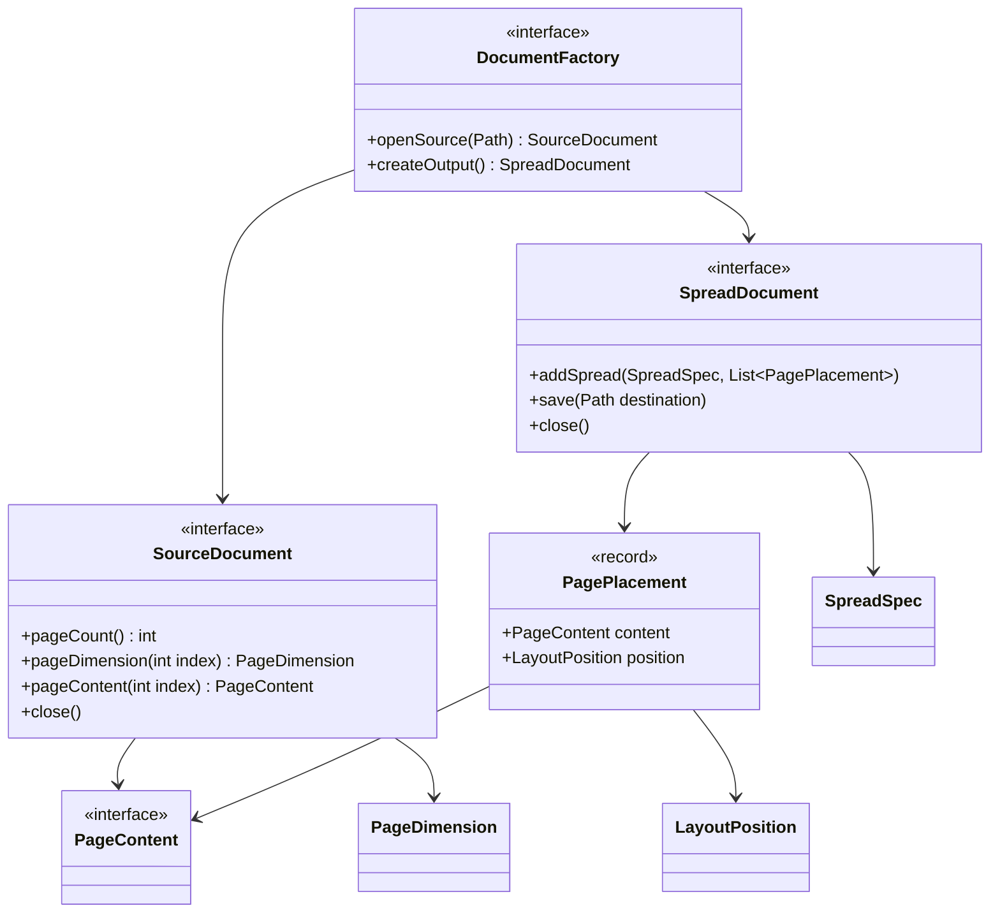
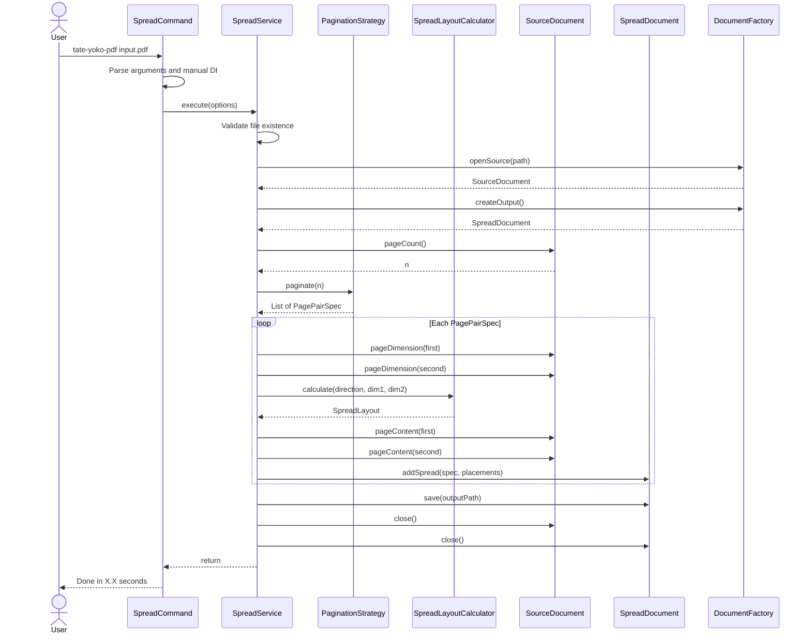
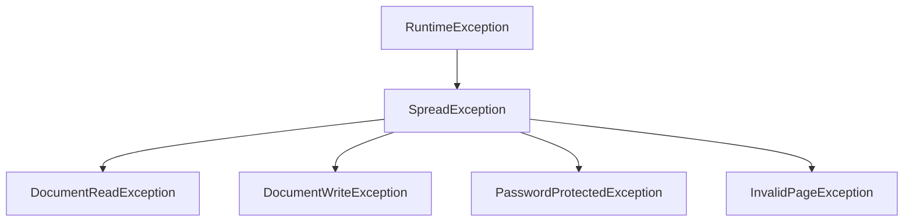

# tate-yoko-pdf 技術設計書

<aside>
📋

**文書情報**

*プロジェクト名:* tate-yoko-pdf

*バージョン:* 1.0.0

*著者:* 坂下 康信

*最終更新:* 2026-03-07

*ステータス:* Final

</aside>

## 1. 概要

**tate-yoko-pdf** は、縦書き日本語書籍のスキャンPDFを見開きレイアウトに変換するコマンドラインツールである。2つの縦長（ポートレート）ページを1つの横長（ランドスケープ）見開きページに結合し、右綴じ（RTL）の読み順を正しく再現する。

**設計目標**

- ゼロ設定で実用可能なデフォルト動作
- OCRテキストレイヤーを含むあらゆるPDF構造の透過的処理
- ページサイズ不均一・奇数ページなどのエッジケースに対するロバスト処理
- ライブラリ非依存のドメイン層による高いテスタビリティ
- GraalVM native-imageによる単一バイナリ配布

---

## 2. 背景と課題

日本語の縦書き書籍は右綴じ（右から左への読み順）で組版される。書籍をスキャンしてPDF化した場合、各ページは縦長の画像としてPDFに格納される。PCの横長ディスプレイでこれらを快適に閲覧するには、2ページを横に並べた見開き表示が最適である。

しかし、一般的なPDFリーダーの見開きモードは横書き（左綴じ、LTR）を前提としており、ページの並び順が「左が先、右が後」になる。縦書き書籍では「右が先、左が後」であるため、見開きの左右が逆転し、読みにくい状態になる。

<aside>
💡

**解決方針:** ソースPDFの連続する2ページを物理的に1ページに結合し、RTL順（右に先のページ、左に後のページ）で配置した新しいPDFを生成する。これにより、どのPDFリーダーでも正しい見開き表示が得られる。

</aside>

---

## 3. 要件定義

### 3.1 機能要件

- **FR-01** 2つの縦長PDFページを1つの横長見開きページに結合する
- **FR-02** RTL配置（右=先のページ、左=後のページ）をデフォルトとする
- **FR-03** LTR配置もオプションとしてサポートする
- **FR-04** ページサイズが不均一な場合、各ペアの最大サイズに合わせてセンタリング配置する
- **FR-05** 奇数ページの場合、最終ページを読み順の先頭側（RTLなら右側）に配置し、残りを空白とする
- **FR-06** 表紙（1ページ目）を単独見開きとして扱うオプションを提供する
- **FR-07** OCRテキストレイヤー、注釈などのページコンテンツを可能な限り保持する
- **FR-08** 出力ファイル名を省略した場合、入力ファイル名から自動生成する（`input.pdf` → `input_spread.pdf`）
- **FR-09** 処理の進捗をコンソールに表示する

### 3.2 非機能要件

- **NFR-01** コマンドライン引数なし（入力ファイルパスのみ）で実用的な出力を得られること
- **NFR-02** 単一の実行可能バイナリとして配布可能であること
- **NFR-03** 1,000ページのPDFを60秒以内に処理できること（一般的なデスクトップ環境）
- **NFR-04** メモリ使用量が入力PDFファイルサイズの3倍を超えないこと
- **NFR-05** Java 21以上で動作すること

### 3.3 制約事項

- パスワード保護されたPDFは処理対象外とする（エラーメッセージで明示的に通知）
- PDFのフォーム入力フィールドは保持対象外とする
- ページの `Rotation` 属性が設定されている場合、回転を適用した実効サイズで結合する

---

## 4. 技術スタック

### 4.1 ランタイム・言語

- **Java 21 LTS**
    - Record、Sealed Interface、Pattern Matchingなどモダンな言語機能を活用
    - 長期サポート版により安定した実行環境を保証

### 4.2 ライブラリ

- **Apache PDFBox 3.x** (Apache 2.0)
    - PDF操作のデファクトスタンダード。ページのFormXObject変換、座標変換、メタデータ操作を網羅
    - 選定理由: Goの `pdfcpu` や `unipdf` と比較して圧倒的に成熟。FormXObjectによるページ丸ごとの埋め込みが可能で、OCRテキストレイヤーも自然に保持される
- **picocli 4.x** (Apache 2.0)
    - アノテーション駆動のCLIフレームワーク。型安全なパラメータパース、自動ヘルプ生成、ANSI色付き出力を提供
    - 選定理由: 宣言的なAPI設計により、CLIの構文定義とビジネスロジックが明確に分離される
- **SLF4J 2.x + Logback 1.5.x**
    - 構造化ロギング。`-v` / `--verbose` オプションでログレベルを動的に切り替え

### 4.3 テスト

- **JUnit 5** + **AssertJ**
    - ドメイン層の純粋なユニットテストと、実PDFを使った統合テストの両方をカバー

### 4.4 ビルド・配布

- **Gradle (Kotlin DSL)**
    - ビルドスクリプトの型安全性とIDEサポートを両立
- **GraalVM native-image**
    - JVMなしで動作する単一バイナリを生成。起動時間の大幅短縮とゼロ設定配布を実現

<aside>
⚠️

**GraalVM native-image の注意点:** PDFBoxは内部でリフレクションを使用する。native-image ビルド時に `reflect-config.json` や `resource-config.json` の設定が必要になる場合がある。GraalVM Tracing Agent（`-agentlib:native-image-agent`）を用いてテスト実行時に自動収集し、`src/main/resources/META-INF/native-image/` に配置する運用を推奨する。

</aside>

---

## 5. アーキテクチャ設計

### 5.1 設計原則

- **ヘキサゴナルアーキテクチャ（Ports & Adapters）**: ドメインロジックを外部ライブラリから完全に隔離し、テスタビリティを最大化する
- **依存性逆転の原則（DIP）**: ドメイン層がPortインターフェースを定義し、インフラ層がそれを実装する。依存の方向は常に外側から内側へ
- **最小依存の原則**: DIフレームワークは使用しない。CLI層のエントリポイントで手動DI（Constructor Injection）を行い、依存関係を明示的に組み立てる
- **シングルスレッド設計**: PDFBoxの `PDDocument` はスレッドセーフではないため、全処理をシングルスレッドで実行する。CLIツールとしてはこれで十分であり、並行処理の複雑性を排除する

### 5.2 レイヤー構成



- **Domain Layer**: PDF非依存。見開きレイアウトの幾何計算、ページペアリング戦略を担当
- **Port Layer**: ドメインが外部（PDF操作）に求めるインターフェースを定義
- **Infrastructure Layer**: PDFBoxを用いたPort実装。PDFBox固有の処理をここに閉じ込める
- **Application Layer**: ドメインとPortを組み合わせるオーケストレーション。ビジネスユースケースの実行単位
- **CLI Layer**: picocliによるコマンドライン引数パース、手動DI、エントリポイント

### 5.3 パッケージ構造

```jsx
dev.sakashita.tateyokopdf
├── domain
│   ├── model
│   │   ├── PageDimension.java
│   │   ├── ReadingDirection.java
│   │   ├── SpreadSpec.java
│   │   ├── LayoutPosition.java
│   │   ├── SpreadLayout.java
│   │   └── PagePairSpec.java          (sealed interface)
│   ├── service
│   │   └── SpreadLayoutCalculator.java
│   └── strategy
│       ├── PaginationStrategy.java    (sealed interface)
│       ├── StandardPagination.java
│       └── CoverSinglePagination.java
├── port
│   ├── PageContent.java               (opaque marker interface)
│   ├── PagePlacement.java
│   ├── SourceDocument.java
│   ├── SpreadDocument.java
│   ├── DocumentFactory.java
│   └── exception
│       ├── SpreadException.java
│       ├── DocumentReadException.java
│       ├── DocumentWriteException.java
│       ├── PasswordProtectedException.java
│       └── InvalidPageException.java
├── application
│   ├── SpreadService.java
│   ├── SpreadOptions.java
│   └── ProgressListener.java
├── infrastructure
│   └── pdfbox
│       ├── PdfBoxDocumentFactory.java
│       ├── PdfBoxSourceDocument.java
│       ├── PdfBoxSpreadDocument.java
│       └── PdfBoxPageContent.java
└── cli
    ├── SpreadCommand.java
    └── ConsoleProgressListener.java
```

### 5.4 依存性注入

DIフレームワークを使用せず、CLI層のエントリポイントで全ての依存関係を手動で組み立てる。小規模プロジェクトにおいてフレームワークのオーバーヘッドを排除し、依存グラフを完全に可視化する設計判断である。

```java
// SpreadCommand#call() 内
var factory = new PdfBoxDocumentFactory();
var calculator = new SpreadLayoutCalculator();
var strategy = coverSingle
    ? new CoverSinglePagination()
    : new StandardPagination();
var listener = new ConsoleProgressListener();
var service = new SpreadService(factory, calculator, strategy, listener);
service.execute(options);
```

---

## 6. ドメインモデル設計

ドメイン層はPDFライブラリに一切依存しない。純粋なJavaコードで構成され、見開きレイアウトの幾何計算とページペアリングのロジックを担当する。

### 6.1 クラス図



### 6.2 値オブジェクト

全ての値オブジェクトはJava `record` として実装し、不変性と `equals` / `hashCode` / `toString` の自動導出を保証する。

#### PageDimension

ページの物理的な寸法を表す。単位はPDFポイント（1pt = 1/72インチ）。

```java
package dev.sakashita.tateyokopdf.domain.model;

public record PageDimension(float widthPt, float heightPt) {

    public PageDimension {
        if (widthPt <= 0 || heightPt <= 0) {
            throw new IllegalArgumentException(
                "Page dimensions must be positive: width=%f, height=%f"
                    .formatted(widthPt, heightPt));
        }
    }

    /**
     * 2つの寸法の各辺の最大値を取った新しい寸法を返す。
     * 見開きペアの外接矩形を求めるために使用する。
     */
    public static PageDimension max(PageDimension a, PageDimension b) {
        return new PageDimension(
            Math.max(a.widthPt, b.widthPt),
            Math.max(a.heightPt, b.heightPt)
        );
    }
}
```

#### ReadingDirection

読み順の方向を表す列挙型。

```java
package dev.sakashita.tateyokopdf.domain.model;

public enum ReadingDirection {
    /** 右から左（縦書き日本語）。先のページを右側に配置する */
    RTL,
    /** 左から右（横書き）。先のページを左側に配置する */
    LTR;

    public static final ReadingDirection DEFAULT = RTL;
}
```

#### SpreadSpec

結合後の見開きページの寸法を表す。

```java
package dev.sakashita.tateyokopdf.domain.model;

public record SpreadSpec(float widthPt, float heightPt) {

    public SpreadSpec {
        if (widthPt <= 0 || heightPt <= 0) {
            throw new IllegalArgumentException(
                "Spread dimensions must be positive: width=%f, height=%f"
                    .formatted(widthPt, heightPt));
        }
    }
}
```

#### LayoutPosition

見開きページ上での配置オフセットを表す。PDF座標系（原点:左下）に準拠する。

```java
package dev.sakashita.tateyokopdf.domain.model;

public record LayoutPosition(float offsetXPt, float offsetYPt) {}
```

#### SpreadLayout

見開きレイアウトの計算結果。見開き寸法と各ページの配置位置を保持する。

<aside>
💡

**設計ノート:** 現実装では `Optional<LayoutPosition>` を record コンポーネントに使用しているが、より型安全な代替設計として `SpreadLayout` 自体を sealed interface とし、`PairLayout`（2ページ見開き）と `SingleLayout`（単独見開き）に分割するアプローチがある。これにより `Optional` を record に持つアンチパターンを回避でき、`switch` 式でのパターンマッチング網羅性チェックも活用できる。現設計では単一 record の簡潔さを優先したが、ドメインモデルの表現力を最大化する場合は sealed interface パターンへの移行を推奨する。

</aside>

```java
package dev.sakashita.tateyokopdf.domain.model;

import java.util.Optional;

public record SpreadLayout(
    SpreadSpec spec,
    LayoutPosition firstPosition,
    Optional<LayoutPosition> secondPosition
) {
    public SpreadLayout {
        if (spec == null || firstPosition == null || secondPosition == null) {
            throw new IllegalArgumentException("All fields must be non-null");
        }
    }
}
```

#### PagePairSpec

ページペアリングの結果を表す sealed interface。Pair（2ページ結合）と Single（単独ページ）の2つの実装を持つ。

```java
package dev.sakashita.tateyokopdf.domain.model;

public sealed interface PagePairSpec {

    /** 2ページを見開きにするペア */
    record Pair(int firstIndex, int secondIndex) implements PagePairSpec {
        public Pair {
            if (firstIndex < 0 || secondIndex < 0) {
                throw new IllegalArgumentException("Page indices must be non-negative");
            }
        }
    }

    /** 単独ページの見開き（残り半分は空白） */
    record Single(int pageIndex) implements PagePairSpec {
        public Single {
            if (pageIndex < 0) {
                throw new IllegalArgumentException("Page index must be non-negative");
            }
        }
    }
}
```

### 6.3 ドメインサービス: SpreadLayoutCalculator

見開きレイアウトの幾何計算を担当するステートレスなドメインサービス。

**アルゴリズム:**

1. ペアの2ページ（または単独ページ）の寸法から外接矩形を求める
2. 見開き幅 = 外接矩形の幅 x 2、見開き高さ = 外接矩形の高さ
3. 各ページを該当する半面（RTLなら先のページが右半面）の中央に配置するオフセットを算出

```java
package dev.sakashita.tateyokopdf.domain.service;

import dev.sakashita.tateyokopdf.domain.model.*;
import java.util.Optional;

public class SpreadLayoutCalculator {

    /**
     * 2ページ分の見開きレイアウトを計算する。
     *
     * @param direction    読み順の方向
     * @param firstDim     読み順で先のページの寸法
     * @param secondDim    読み順で後のページの寸法（nullなら単独ページ）
     * @return 計算されたレイアウト
     */
    public SpreadLayout calculate(
            ReadingDirection direction,
            PageDimension firstDim,
            PageDimension secondDim) {

        // 外接矩形の算出
        PageDimension bounds = (secondDim != null)
            ? PageDimension.max(firstDim, secondDim)
            : firstDim;

        float halfWidth = bounds.widthPt();
        float spreadWidth = halfWidth * 2;
        float spreadHeight = bounds.heightPt();
        SpreadSpec spec = new SpreadSpec(spreadWidth, spreadHeight);

        // 先のページの配置位置
        float firstCenterX = (halfWidth - firstDim.widthPt()) / 2;
        float firstCenterY = (spreadHeight - firstDim.heightPt()) / 2;

        float firstOffsetX = switch (direction) {
            case RTL -> halfWidth + firstCenterX;  // 右半面
            case LTR -> firstCenterX;              // 左半面
        };

        LayoutPosition firstPos = new LayoutPosition(firstOffsetX, firstCenterY);

        // 後のページの配置位置（存在する場合）
        Optional<LayoutPosition> secondPos;
        if (secondDim != null) {
            float secondCenterX = (halfWidth - secondDim.widthPt()) / 2;
            float secondCenterY = (spreadHeight - secondDim.heightPt()) / 2;

            float secondOffsetX = switch (direction) {
                case RTL -> secondCenterX;              // 左半面
                case LTR -> halfWidth + secondCenterX;  // 右半面
            };

            secondPos = Optional.of(new LayoutPosition(secondOffsetX, secondCenterY));
        } else {
            secondPos = Optional.empty();
        }

        return new SpreadLayout(spec, firstPos, secondPos);
    }
}
```

### 6.4 ページネーション戦略

ページの組み合わせ方を戦略パターン（sealed interface）で表現する。sealed interfaceにより、パターンマッチングの網羅性チェックがコンパイル時に保証される。

#### PaginationStrategy

```java
package dev.sakashita.tateyokopdf.domain.strategy;

import dev.sakashita.tateyokopdf.domain.model.PagePairSpec;
import java.util.List;

public sealed interface PaginationStrategy
    permits StandardPagination, CoverSinglePagination {

    /**
     * 総ページ数からページペアリングのリストを生成する。
     *
     * @param totalPages ソースPDFの総ページ数
     * @return 読み順に並んだペアリングのリスト
     * @throws IllegalArgumentException totalPagesが0以下の場合
     */
    List<PagePairSpec> paginate(int totalPages);
}
```

#### StandardPagination

全ページを先頭から順に2枚ずつペアリングする。奇数の場合、最終ページは単独見開きになる。

```java
package dev.sakashita.tateyokopdf.domain.strategy;

import dev.sakashita.tateyokopdf.domain.model.PagePairSpec;
import java.util.ArrayList;
import java.util.List;

public final class StandardPagination implements PaginationStrategy {

    @Override
    public List<PagePairSpec> paginate(int totalPages) {
        if (totalPages <= 0) {
            throw new IllegalArgumentException("totalPages must be positive: " + totalPages);
        }

        List<PagePairSpec> result = new ArrayList<>();

        for (int i = 0; i < totalPages; i += 2) {
            if (i + 1 < totalPages) {
                result.add(new PagePairSpec.Pair(i, i + 1));
            } else {
                result.add(new PagePairSpec.Single(i));
            }
        }

        return List.copyOf(result);
    }
}
```

*生成例（6ページ）:* `[Pair(0,1), Pair(2,3), Pair(4,5)]`

*生成例（5ページ）:* `[Pair(0,1), Pair(2,3), Single(4)]`

#### CoverSinglePagination

表紙（0ページ目）を単独見開きにし、残りを順にペアリングする。

```java
package dev.sakashita.tateyokopdf.domain.strategy;

import dev.sakashita.tateyokopdf.domain.model.PagePairSpec;
import java.util.ArrayList;
import java.util.List;

public final class CoverSinglePagination implements PaginationStrategy {

    @Override
    public List<PagePairSpec> paginate(int totalPages) {
        if (totalPages <= 0) {
            throw new IllegalArgumentException("totalPages must be positive: " + totalPages);
        }

        List<PagePairSpec> result = new ArrayList<>();

        // 表紙は単独見開き
        result.add(new PagePairSpec.Single(0));

        // 残りを2枚ずつペアリング
        for (int i = 1; i < totalPages; i += 2) {
            if (i + 1 < totalPages) {
                result.add(new PagePairSpec.Pair(i, i + 1));
            } else {
                result.add(new PagePairSpec.Single(i));
            }
        }

        return List.copyOf(result);
    }
}
```

*生成例（6ページ）:* `[Single(0), Pair(1,2), Pair(3,4), Single(5)]`

*生成例（5ページ）:* `[Single(0), Pair(1,2), Pair(3,4)]`

---

## 7. ポート層設計

ポート層はドメインが外部（PDF操作）に求めるインターフェースを定義する。このインターフェースによりドメイン層とインフラ層が疎結合になり、テスト時にはモック実装に差し替えられる。

### 7.1 クラス図



### 7.2 インターフェース定義

#### PageContent（不透明ハンドル）

ソースページのコンテンツを表す不透明マーカーインターフェース。ドメイン層とアプリケーション層はこのインターフェースの中身を一切知らず、ただ受け渡すだけである。実体（PDFBoxの `PDFormXObject` など）はインフラ層のみが知る。

このパターンにより、ドメインロジックはPDFの内部構造に依存せず、テスト時には軽量なダミー実装で代替できる。

```java
package dev.sakashita.tateyokopdf.port;

/**
 * ソースPDFの1ページ分のコンテンツを表す不透明ハンドル。
 * ドメイン層はこのインターフェースの実装詳細を参照してはならない。
 */
public interface PageContent {
    // マーカーインターフェース: メソッドなし
}
```

#### SourceDocument

```java
package dev.sakashita.tateyokopdf.port;

import dev.sakashita.tateyokopdf.domain.model.PageDimension;

public interface SourceDocument extends AutoCloseable {

    /** ソースPDFの総ページ数を返す */
    int pageCount();

    /**
     * 指定インデックスのページ寸法を返す。
     * Rotation属性が設定されている場合、回転適用後の実効寸法を返す。
     *
     * @param index 0始まりのページインデックス
     * @throws IndexOutOfBoundsException インデックスが範囲外の場合
     */
    PageDimension pageDimension(int index);

    /**
     * 指定インデックスのページコンテンツを不透明ハンドルとして返す。
     * 返されたハンドルはSpreadDocument#addSpreadに渡して使用する。
     *
     * @param index 0始まりのページインデックス
     * @throws IndexOutOfBoundsException インデックスが範囲外の場合
     */
    PageContent pageContent(int index);

    @Override
    void close();
}
```

#### SpreadDocument

```java
package dev.sakashita.tateyokopdf.port;

import dev.sakashita.tateyokopdf.domain.model.SpreadSpec;
import java.nio.file.Path;
import java.util.List;

public interface SpreadDocument extends AutoCloseable {

    /**
     * 指定されたレイアウトで見開きページを追加する。
     * 呼び出し順が出力PDFのページ順になる。
     *
     * @param spec       見開きの寸法
     * @param placements 配置するページコンテンツと位置のリスト（1要素または2要素）
     */
    void addSpread(SpreadSpec spec, List<PagePlacement> placements);

    /**
     * 構築した見開きPDFを指定パスに保存する。
     *
     * @param destination 出力先ファイルパス
     */
    void save(Path destination);

    @Override
    void close();
}
```

#### PagePlacement

PageContentとLayoutPositionを結合するポート層の値オブジェクト。

```java
package dev.sakashita.tateyokopdf.port;

import dev.sakashita.tateyokopdf.domain.model.LayoutPosition;

public record PagePlacement(PageContent content, LayoutPosition position) {
    public PagePlacement {
        if (content == null || position == null) {
            throw new IllegalArgumentException("content and position must not be null");
        }
    }
}
```

#### DocumentFactory

```java
package dev.sakashita.tateyokopdf.port;

import java.nio.file.Path;

public interface DocumentFactory {

    /**
     * ソースPDFを開く。
     *
     * @param path ソースPDFのファイルパス
     * @throws DocumentReadException 読み込みに失敗した場合
     * @throws PasswordProtectedException パスワード保護されている場合
     */
    SourceDocument openSource(Path path);

    /** 空の出力ドキュメントを生成する */
    SpreadDocument createOutput();
}
```

---

## 8. インフラストラクチャ層設計

PDFBox 3.xを用いてポート層のインターフェースを実装する。PDFBox固有の処理は全てこの層に閉じ込める。

### 8.1 PDF座標系の基礎知識

<aside>
📐

**PDF座標系**

- 原点は **左下隅**
- 単位は **ポイント**（1pt = 1/72インチ）
- A4サイズ: 595.28 x 841.89 pt
- B5サイズ: 498.90 x 708.66 pt
- **MediaBox**: ページの物理的な境界を定義する矩形
- **CropBox**: 表示・印刷時に使用される矩形。未設定の場合MediaBoxと同一
- **Rotation**: ページの表示回転（0, 90, 180, 270度）。MediaBoxの値は変わらないが、実効的な幅と高さが入れ替わる
</aside>

### 8.2 FormXObjectによるページ埋め込み

本ツールの中核的な技術的判断として、ソースページを **PDFormXObject** として出力ページに埋め込む方式を採用する。

**FormXObject** はPDF仕様で定義された再利用可能なコンテンツストリームである。ページ全体をFormXObjectとして取り込むことで、ページに含まれる全ての要素（テキスト、画像、ベクターグラフィックス、OCR透明テキスト）がそのまま保持される。個々の要素を解析・再構成する必要がないため、堅牢性と実装の簡潔さを両立できる。

PDFBoxでは `LayerUtility.importPageAsForm()` がこの変換を提供する。

### 8.3 PdfBoxPageContent

`PageContent` の PDFBox実装。ソース `PDDocument` とページインデックスへの参照を保持し、出力ドキュメントへのインポートを遅延実行する。

```java
package dev.sakashita.tateyokopdf.infrastructure.pdfbox;

import dev.sakashita.tateyokopdf.port.PageContent;
import org.apache.pdfbox.multipdf.LayerUtility;
import org.apache.pdfbox.pdmodel.PDDocument;
import org.apache.pdfbox.pdmodel.graphics.form.PDFormXObject;

public class PdfBoxPageContent implements PageContent {

    private final PDDocument sourceDocument;
    private final int pageIndex;

    PdfBoxPageContent(PDDocument sourceDocument, int pageIndex) {
        this.sourceDocument = sourceDocument;
        this.pageIndex = pageIndex;
    }

    /**
     * このページを対象ドキュメントにFormXObjectとしてインポートする。
     * Infrastructure層内部でのみ呼び出される。
     */
    PDFormXObject importInto(PDDocument targetDocument) {
        var layerUtility = new LayerUtility(targetDocument);
        return layerUtility.importPageAsForm(sourceDocument, pageIndex);
    }
}
```

### 8.4 PdfBoxSourceDocument

```java
package dev.sakashita.tateyokopdf.infrastructure.pdfbox;

import dev.sakashita.tateyokopdf.domain.model.PageDimension;
import dev.sakashita.tateyokopdf.port.PageContent;
import dev.sakashita.tateyokopdf.port.SourceDocument;
import org.apache.pdfbox.pdmodel.PDDocument;
import org.apache.pdfbox.pdmodel.PDPage;
import org.apache.pdfbox.pdmodel.common.PDRectangle;
import org.slf4j.Logger;
import org.slf4j.LoggerFactory;

public class PdfBoxSourceDocument implements SourceDocument {

    private static final Logger log = LoggerFactory.getLogger(PdfBoxSourceDocument.class);
    private final PDDocument document;

    PdfBoxSourceDocument(PDDocument document) {
        this.document = document;
    }

    @Override
    public int pageCount() {
        return document.getNumberOfPages();
    }

    @Override
    public PageDimension pageDimension(int index) {
        PDPage page = document.getPage(index);
        PDRectangle cropBox = page.getCropBox(); // CropBoxを優先（未設定ならMediaBox）
        int rotation = page.getRotation();

        float width = cropBox.getWidth();
        float height = cropBox.getHeight();

        // 90度・270度回転の場合、幅と高さを入れ替える
        if (rotation == 90 || rotation == 270) {
            log.debug("Page {} has rotation={}, swapping dimensions", index, rotation);
            return new PageDimension(height, width);
        }

        return new PageDimension(width, height);
    }

    @Override
    public PageContent pageContent(int index) {
        return new PdfBoxPageContent(document, index);
    }

    @Override
    public void close() {
        try {
            document.close();
        } catch (Exception e) {
            log.warn("Failed to close source document", e);
        }
    }
}
```

### 8.5 PdfBoxSpreadDocument

```java
package dev.sakashita.tateyokopdf.infrastructure.pdfbox;

import dev.sakashita.tateyokopdf.domain.model.SpreadSpec;
import dev.sakashita.tateyokopdf.port.PagePlacement;
import dev.sakashita.tateyokopdf.port.SpreadDocument;
import org.apache.pdfbox.pdmodel.PDDocument;
import org.apache.pdfbox.pdmodel.PDPage;
import org.apache.pdfbox.pdmodel.PDPageContentStream;
import org.apache.pdfbox.pdmodel.common.PDRectangle;
import org.apache.pdfbox.pdmodel.graphics.form.PDFormXObject;
import org.apache.pdfbox.util.Matrix;
import org.slf4j.Logger;
import org.slf4j.LoggerFactory;

import java.io.IOException;
import java.nio.file.Path;
import java.util.List;

public class PdfBoxSpreadDocument implements SpreadDocument {

    private static final Logger log = LoggerFactory.getLogger(PdfBoxSpreadDocument.class);
    private final PDDocument document;

    PdfBoxSpreadDocument() {
        this.document = new PDDocument();
    }

    @Override
    public void addSpread(SpreadSpec spec, List<PagePlacement> placements) {
        var rect = new PDRectangle(spec.widthPt(), spec.heightPt());
        var page = new PDPage(rect);
        document.addPage(page);

        try (var cs = new PDPageContentStream(document, page)) {
            for (var placement : placements) {
                var pdfBoxContent = (PdfBoxPageContent) placement.content();
                PDFormXObject form = pdfBoxContent.importInto(document);

                // グラフィックス状態を保存し、ページごとに独立した座標変換を適用
                cs.saveGraphicsState();
                cs.transform(Matrix.getTranslateInstance(
                    placement.position().offsetXPt(),
                    placement.position().offsetYPt()
                ));
                cs.drawForm(form);
                cs.restoreGraphicsState();
            }
        } catch (IOException e) {
            throw new DocumentWriteException("Failed to create spread page", e);
        }

        log.debug("Added spread: {}x{} pt with {} placements",
            spec.widthPt(), spec.heightPt(), placements.size());
    }

    @Override
    public void save(Path destination) {
        try {
            document.save(destination.toFile());
            log.info("Saved output to {}", destination);
        } catch (IOException e) {
            throw new DocumentWriteException("Failed to save output PDF: " + destination, e);
        }
    }

    @Override
    public void close() {
        try {
            document.close();
        } catch (Exception e) {
            log.warn("Failed to close output document", e);
        }
    }
}
```

<aside>
⚠️

**`saveGraphicsState` / `restoreGraphicsState` の必要性:** PDFのコンテンツストリームにおける座標変換は累積的に適用される。各ページ配置前にグラフィックス状態を保存し、配置後に復元することで、複数のページを独立した座標系で正しく配置できる。

</aside>

### 8.6 PdfBoxDocumentFactory

```java
package dev.sakashita.tateyokopdf.infrastructure.pdfbox;

import dev.sakashita.tateyokopdf.port.DocumentFactory;
import dev.sakashita.tateyokopdf.port.SourceDocument;
import dev.sakashita.tateyokopdf.port.SpreadDocument;
import org.apache.pdfbox.Loader;
import org.apache.pdfbox.pdmodel.encryption.InvalidPasswordException;
import org.slf4j.Logger;
import org.slf4j.LoggerFactory;

import java.io.IOException;
import java.nio.file.Path;

public class PdfBoxDocumentFactory implements DocumentFactory {

    private static final Logger log = LoggerFactory.getLogger(PdfBoxDocumentFactory.class);

    @Override
    public SourceDocument openSource(Path path) {
        log.info("Opening source PDF: {}", path);
        try {
            var doc = Loader.loadPDF(path.toFile());
            return new PdfBoxSourceDocument(doc);
        } catch (InvalidPasswordException e) {
            throw new PasswordProtectedException(
                "The PDF is password-protected and cannot be processed: " + path, e);
        } catch (IOException e) {
            throw new DocumentReadException(
                "Failed to open PDF: " + path, e);
        }
    }

    @Override
    public SpreadDocument createOutput() {
        return new PdfBoxSpreadDocument();
    }
}
```

---

## 9. アプリケーション層設計

アプリケーション層はドメインとポートを組み合わせてユースケースを実行するオーケストレーション層である。

### 9.1 SpreadOptions

```java
package dev.sakashita.tateyokopdf.application;

import dev.sakashita.tateyokopdf.domain.model.ReadingDirection;
import java.nio.file.Path;
import java.util.Objects;

public record SpreadOptions(
    Path sourcePath,
    Path outputPath,
    ReadingDirection direction,
    boolean coverSingle
) {
    public SpreadOptions {
        Objects.requireNonNull(sourcePath, "sourcePath must not be null");
        Objects.requireNonNull(outputPath, "outputPath must not be null");
        Objects.requireNonNull(direction, "direction must not be null");
    }
    /** 入力パスのみから最小限のデフォルトオプションを生成する */
    public static SpreadOptions withDefaults(Path sourcePath) {
        return new SpreadOptions(
            sourcePath,
            deriveOutputPath(sourcePath),
            ReadingDirection.DEFAULT,
            false
        );
    }

    private static Path deriveOutputPath(Path source) {
        String name = source.getFileName().toString();
        String output = name.replaceFirst("(?i)\\.pdf$", "_spread.pdf");
        return source.resolveSibling(output);
    }
}
```

### 9.2 ProgressListener

処理の進捗を外部に通知するためのコールバックインターフェース。CLI層がコンソール出力の実装を提供する。

```java
package dev.sakashita.tateyokopdf.application;

public interface ProgressListener {

    /** 処理開始時に呼ばれる */
    void onStart(int totalSpreads);

    /** 見開き1ページの処理完了時に呼ばれる */
    void onSpreadComplete(int currentSpread, int totalSpreads);

    /** 全処理完了時に呼ばれる */
    void onComplete(long elapsedMillis);
}
```

### 9.3 SpreadService

全体のオーケストレーションを担当する中核クラス。

```java
package dev.sakashita.tateyokopdf.application;

import dev.sakashita.tateyokopdf.domain.model.*;
import dev.sakashita.tateyokopdf.domain.service.SpreadLayoutCalculator;
import dev.sakashita.tateyokopdf.domain.strategy.PaginationStrategy;
import dev.sakashita.tateyokopdf.port.*;
import org.slf4j.Logger;
import org.slf4j.LoggerFactory;

import java.util.ArrayList;
import java.util.List;

public class SpreadService {

    private static final Logger log = LoggerFactory.getLogger(SpreadService.class);

    private final DocumentFactory documentFactory;
    private final SpreadLayoutCalculator calculator;
    private final PaginationStrategy paginationStrategy;
    private final ProgressListener progressListener;

    public SpreadService(
            DocumentFactory documentFactory,
            SpreadLayoutCalculator calculator,
            PaginationStrategy paginationStrategy,
            ProgressListener progressListener) {
        this.documentFactory = documentFactory;
        this.calculator = calculator;
        this.paginationStrategy = paginationStrategy;
        this.progressListener = progressListener;
    }

    public void execute(SpreadOptions options) {
        if (!java.nio.file.Files.exists(options.sourcePath())) {
            throw new IllegalArgumentException(
                "Source file does not exist: " + options.sourcePath());
        }
        long startTime = System.currentTimeMillis();

        try (var source = documentFactory.openSource(options.sourcePath());
             var output = documentFactory.createOutput()) {

            int totalPages = source.pageCount();
            log.info("Source PDF: {} pages", totalPages);

            List<PagePairSpec> pairs = paginationStrategy.paginate(totalPages);
            progressListener.onStart(pairs.size());

            for (int i = 0; i < pairs.size(); i++) {
                processSpread(source, output, pairs.get(i), options.direction());
                progressListener.onSpreadComplete(i + 1, pairs.size());
            }

            output.save(options.outputPath());
            progressListener.onComplete(System.currentTimeMillis() - startTime);
        }
    }

    private void processSpread(
            SourceDocument source,
            SpreadDocument output,
            PagePairSpec pairSpec,
            ReadingDirection direction) {

        switch (pairSpec) {
            case PagePairSpec.Pair(var first, var second) -> {
                PageDimension firstDim = source.pageDimension(first);
                PageDimension secondDim = source.pageDimension(second);

                SpreadLayout layout = calculator.calculate(direction, firstDim, secondDim);

                List<PagePlacement> placements = List.of(
                    new PagePlacement(source.pageContent(first), layout.firstPosition()),
                    new PagePlacement(source.pageContent(second), layout.secondPosition().orElseThrow())
                );

                output.addSpread(layout.spec(), placements);
            }

            case PagePairSpec.Single(var pageIndex) -> {
                PageDimension dim = source.pageDimension(pageIndex);

                SpreadLayout layout = calculator.calculate(direction, dim, null);

                List<PagePlacement> placements = List.of(
                    new PagePlacement(source.pageContent(pageIndex), layout.firstPosition())
                );

                output.addSpread(layout.spec(), placements);
            }
        }
    }
}
```

---

## 10. CLI層設計

### 10.1 SpreadCommand

picocliによるコマンド定義。エントリポイントとして手動DIを実行し、`SpreadService` にデリゲートする。

```java
package dev.sakashita.tateyokopdf.cli;

import dev.sakashita.tateyokopdf.application.*;
import dev.sakashita.tateyokopdf.domain.model.ReadingDirection;
import dev.sakashita.tateyokopdf.domain.service.SpreadLayoutCalculator;
import dev.sakashita.tateyokopdf.domain.strategy.*;
import dev.sakashita.tateyokopdf.infrastructure.pdfbox.PdfBoxDocumentFactory;
import picocli.CommandLine;
import picocli.CommandLine.Command;
import picocli.CommandLine.Option;
import picocli.CommandLine.Parameters;

import java.nio.file.Path;
import java.util.concurrent.Callable;

@Command(
    name = "tate-yoko-pdf",
    mixinStandardHelpOptions = true,
    version = "tate-yoko-pdf 1.0.0",
    description = "Convert scanned PDF pages into RTL spread layout for Japanese vertical text."
)
public class SpreadCommand implements Callable<Integer> {

    @Parameters(index = "0", description = "Input PDF file path")
    private Path input;

    @Option(names = {"-o", "--output"}, description = "Output PDF file path (default: <input>_spread.pdf)")
    private Path output;

    @Option(names = {"-d", "--direction"}, defaultValue = "RTL",
        description = "Reading direction: RTL (default) or LTR")
    private ReadingDirection direction;

    @Option(names = {"--cover-single"},
        description = "Treat the first page as a standalone cover spread")
    private boolean coverSingle;
    @Option(names = {"-v", "--verbose"},
        description = "Enable verbose logging output (DEBUG level)")
    private boolean verbose;

    @Override
    public Integer call() {
        try {
            Path actualOutput = (output != null)
                ? output
                : SpreadOptions.withDefaults(input).outputPath();

            var options = new SpreadOptions(input, actualOutput, direction, coverSingle);
            if (verbose) {
                configureVerboseLogging();
            }

            var factory = new PdfBoxDocumentFactory();
            var calculator = new SpreadLayoutCalculator();
            PaginationStrategy strategy = coverSingle
                ? new CoverSinglePagination()
                : new StandardPagination();
            var listener = new ConsoleProgressListener();

            var service = new SpreadService(factory, calculator, strategy, listener);
            service.execute(options);

            return 0;

        } catch (SpreadException e) {
            System.err.println("Error: " + e.getMessage());
            return 1;
        } catch (Exception e) {
            System.err.println("Unexpected error: " + e.getMessage());
            e.printStackTrace(System.err);
            return 2;
        }
    }

    private static void configureVerboseLogging() {
        var context = (ch.qos.logback.classic.LoggerContext)
            org.slf4j.LoggerFactory.getILoggerFactory();
        context.getLogger(org.slf4j.Logger.ROOT_LOGGER_NAME)
            .setLevel(ch.qos.logback.classic.Level.DEBUG);
    }
    public static void main(String[] args) {
        int exitCode = new CommandLine(new SpreadCommand()).execute(args);
        System.exit(exitCode);
    }
}
```

### 10.2 ConsoleProgressListener

```java
package dev.sakashita.tateyokopdf.cli;

import dev.sakashita.tateyokopdf.application.ProgressListener;

public class ConsoleProgressListener implements ProgressListener {

    @Override
    public void onStart(int totalSpreads) {
        System.out.printf("Processing %d spreads...%n", totalSpreads);
    }

    @Override
    public void onSpreadComplete(int current, int total) {
        System.out.printf("\r[%d/%d] spreads completed", current, total);
    }

    @Override
    public void onComplete(long elapsedMillis) {
        System.out.printf("%nDone in %.1f seconds.%n", elapsedMillis / 1000.0);
    }
}
```

### 10.3 使用例

```bash
# 最小構成（ゼロ設定）: RTL見開きを自動生成
tate-yoko-pdf novel.pdf
# -> novel_spread.pdf が生成される

# 出力先を指定
tate-yoko-pdf novel.pdf -o output/novel_spreads.pdf

# 表紙を単独見開きに
tate-yoko-pdf novel.pdf --cover-single

# 横書きPDF用（LTR方向）
tate-yoko-pdf textbook.pdf -d LTR

# ヘルプ表示
tate-yoko-pdf --help
# 詳細ログを有効化（デバッグ用）
tate-yoko-pdf novel.pdf -v
```

---

## 11. 処理フロー

### 11.1 シーケンス図



---

## 12. エラーハンドリング

### 12.1 例外階層



全ての例外は `SpreadException`（非検査例外）を基底とする。例外クラスはポート層（`port.exception`）に配置し、インフラ層がポートインターフェース実装時にこれらの例外をスローする。CLI層で統一的にキャッチする。この配置により、依存性逆転の原則に沿った例外フローを実現する。

### 12.2 例外クラス

```java
package dev.sakashita.tateyokopdf.port.exception;

/** ポート層例外の基底クラス。インフラ層からスローし、CLI層でキャッチする */
public class SpreadException extends RuntimeException {
    public SpreadException(String message) { super(message); }
    public SpreadException(String message, Throwable cause) { super(message, cause); }
}

/** ソースPDFの読み込み失敗（ファイル不正、破損など） */
public class DocumentReadException extends SpreadException {
    public DocumentReadException(String message, Throwable cause) { super(message, cause); }
}

/** 出力PDFの書き込み失敗（ディスク容量不足、権限エラーなど） */
public class DocumentWriteException extends SpreadException {
    public DocumentWriteException(String message, Throwable cause) { super(message, cause); }
}

/** パスワード保護されたPDFを開こうとした場合 */
public class PasswordProtectedException extends SpreadException {
    public PasswordProtectedException(String message, Throwable cause) { super(message, cause); }
}

/** 不正なページインデックスの参照 */
public class InvalidPageException extends SpreadException {
    public InvalidPageException(String message) { super(message); }
}
```

### 12.3 CLI層でのエラー表示

- `SpreadException`: ユーザー向けのメッセージを `stderr` に出力。終了コード `1`
- 予期しない例外: スタックトレースを `stderr` に出力。終了コード `2`
- 正常終了: 終了コード `0`

---

## 13. ロギング設計

### 13.1 ログレベル方針

- **ERROR**: 処理を続行できない致命的エラー（PDF読み込み失敗、書き込み失敗）
- **WARN**: 処理は続行するが注意が必要な状況（ドキュメントクローズ時のIOException）
- **INFO**: 主要な処理ステップ（ファイルオープン、保存完了、処理時間）
- **DEBUG**: 詳細な処理情報（各ページの寸法、回転、レイアウト計算結果）

### 13.2 ログレベル切り替え

デフォルトでは `WARN` 以上を出力し、`--verbose` オプション指定時に `DEBUG` まで出力する。Logbackの `LevelChangePropagator` を用いてプログラマティックにレベルを変更する。

### 13.3 ログ出力先

- コンソール出力（`stdout`）: 進捗表示（ProgressListener経由）
- ログ出力（`stderr`）: SLF4J/Logback経由の構造化ログ

これらを分離することで、パイプライン処理（`tate-yoko-pdf input.pdf 2>/dev/null`）が安全に行える。

### 13.4 Logback設定ファイル

`src/main/resources/logback.xml` に配置する。デフォルトでは `WARN` 以上を `stderr` に出力し、`--verbose` 指定時にプログラマティックに `DEBUG` へ切り替える。

```xml
<?xml version="1.0" encoding="UTF-8"?>
<configuration>
    <appender name="STDERR" class="ch.qos.logback.core.ConsoleAppender">
        <target>System.err</target>
        <encoder>
            <pattern>%d{HH:mm:ss.SSS} [%level] %logger{36} - %msg%n</pattern>
        </encoder>
    </appender>

    <root level="WARN">
        <appender-ref ref="STDERR" />
    </root>
</configuration>
```

---

## 14. テスト戦略

### 14.1 テストピラミッド

- **ユニットテスト（ドメイン層）**: 外部依存ゼロ。純粋な計算ロジックのテスト
- **ユニットテスト（アプリケーション層）**: Portインターフェースをモック化してオーケストレーションをテスト
- **統合テスト**: 実PDFファイルを用いたエンドツーエンドテスト

### 14.2 ドメイン層テスト例

```java
@Nested
class SpreadLayoutCalculatorTest {

    private final SpreadLayoutCalculator calculator = new SpreadLayoutCalculator();

    @Test
    void rtl_pair_placesFirstPageOnRightHalf() {
        var dim = new PageDimension(500, 800);

        SpreadLayout layout = calculator.calculate(ReadingDirection.RTL, dim, dim);

        // 見開き寸法: 1000 x 800
        assertThat(layout.spec()).isEqualTo(new SpreadSpec(1000, 800));
        // 先のページは右半面（offsetX = 500）
        assertThat(layout.firstPosition().offsetXPt()).isEqualTo(500f);
        // 後のページは左半面（offsetX = 0）
        assertThat(layout.secondPosition().orElseThrow().offsetXPt()).isEqualTo(0f);
    }

    @Test
    void unequalSizes_centersWithinHalf() {
        var small = new PageDimension(400, 700);
        var large = new PageDimension(500, 800);

        SpreadLayout layout = calculator.calculate(ReadingDirection.RTL, small, large);

        // 外接矩形: 500 x 800
        assertThat(layout.spec()).isEqualTo(new SpreadSpec(1000, 800));
        // 小さいページは右半面内でセンタリング: (500-400)/2 = 50、500 + 50 = 550
        assertThat(layout.firstPosition().offsetXPt()).isEqualTo(550f);
        assertThat(layout.firstPosition().offsetYPt()).isEqualTo(50f); // (800-700)/2
    }

    @Test
    void singlePage_hasEmptySecondPosition() {
        var dim = new PageDimension(500, 800);

        SpreadLayout layout = calculator.calculate(ReadingDirection.RTL, dim, null);

        assertThat(layout.secondPosition()).isEmpty();
        // 見開き幅はページ幅の2倍（空白半面を含む）
        assertThat(layout.spec().widthPt()).isEqualTo(1000f);
    }
}
```

```java
@Nested
class StandardPaginationTest {

    private final StandardPagination strategy = new StandardPagination();

    @Test
    void evenPages_allPairs() {
        List<PagePairSpec> result = strategy.paginate(6);

        assertThat(result).containsExactly(
            new PagePairSpec.Pair(0, 1),
            new PagePairSpec.Pair(2, 3),
            new PagePairSpec.Pair(4, 5)
        );
    }

    @Test
    void oddPages_lastIsSingle() {
        List<PagePairSpec> result = strategy.paginate(5);

        assertThat(result).hasSize(3);
        assertThat(result.getLast()).isEqualTo(new PagePairSpec.Single(4));
    }

    @Test
    void singlePage_oneSingle() {
        List<PagePairSpec> result = strategy.paginate(1);

        assertThat(result).containsExactly(new PagePairSpec.Single(0));
    }

    @Test
    void zeroPages_throws() {
        assertThatThrownBy(() -> strategy.paginate(0))
            .isInstanceOf(IllegalArgumentException.class);
    }
}
```

### 14.3 統合テスト

`src/test/resources/fixtures/` にテスト用PDFを配置し、実際のPDF処理を検証する。

- `4pages_portrait.pdf`: 4ページの縦長PDF（正常系の基本ケース）
- `5pages_mixed_sizes.pdf`: ページサイズが異なる5ページのPDF
- `1page.pdf`: 単一ページ
- `rotated_pages.pdf`: Rotation属性が設定されたページを含むPDF
- `ocr_text_layer.pdf`: OCRテキストレイヤー付きPDF
- `password_protected.pdf`: パスワード保護PDF（エラーハンドリングの検証用）

```java
@Test
void endToEnd_4pages_producesCorrectSpreads(@TempDir Path tempDir) throws Exception {
    Path input = Path.of("src/test/resources/fixtures/4pages_portrait.pdf");
    Path output = tempDir.resolve("output.pdf");

    var options = new SpreadOptions(input, output, ReadingDirection.RTL, false);
    // ... execute and verify

    try (var result = Loader.loadPDF(output.toFile())) {
        assertThat(result.getNumberOfPages()).isEqualTo(2); // 4ページ -> 2見開き

        // 各見開きページがランドスケープ（横長）であることを確認
        for (int i = 0; i < result.getNumberOfPages(); i++) {
            PDRectangle mediaBox = result.getPage(i).getMediaBox();
            assertThat(mediaBox.getWidth()).isGreaterThan(mediaBox.getHeight());
        }
    }
}
```

---

## 15. ビルド構成

### 15.1 build.gradle.kts

```kotlin
plugins {
    java
    application
    id("com.gradleup.shadow") version "8.3.5"
    id("org.graalvm.buildtools.native") version "0.10.4"
}

group = "dev.sakashita"
version = "1.0.0"

java {
    toolchain {
        languageVersion = JavaLanguageVersion.of(21)
    }
}

application {
    mainClass = "dev.sakashita.tateyokopdf.cli.SpreadCommand"
}

dependencies {
    implementation("org.apache.pdfbox:pdfbox:3.0.3")
    implementation("info.picocli:picocli:4.7.6")
    implementation("ch.qos.logback:logback-classic:1.5.12")

    annotationProcessor("info.picocli:picocli-codegen:4.7.6")

    testImplementation("org.junit.jupiter:junit-jupiter:5.11.3")
    testImplementation("org.assertj:assertj-core:3.26.3")
}

tasks.test {
    useJUnitPlatform()
}

tasks.shadowJar {
    archiveBaseName = "tate-yoko-pdf"
    archiveClassifier = ""
    mergeServiceFiles()
}
graalvmNative {
    binaries {
        named("main") {
            mainClass = application.mainClass
            buildArgs.add("--no-fallback")
            buildArgs.add("-H:+ReportExceptionStackTraces")
        }
    }
}
```

### 15.2 CI/CDパイプライン（GitHub Actions）

```yaml
name: CI

on:
  push:
    branches: [main]
  pull_request:
    branches: [main]

jobs:
  build:
    runs-on: ubuntu-latest
    steps:
      - uses: actions/checkout@v4

      - uses: graalvm/setup-graalvm@v1
        with:
          java-version: '21'
          distribution: 'graalvm'

      - name: Build and test
        run: ./gradlew build

      - name: Native image build
        run: ./gradlew nativeCompile

      - name: Upload native binary
        uses: actions/upload-artifact@v4
        with:
          name: tate-yoko-pdf-linux
          path: build/native/nativeCompile/tate-yoko-pdf

  release:
    needs: build
    if: startsWith(github.ref, 'refs/tags/v')
    # NOTE: GitHub Actionsでは runs-on: ${{" matrix.os "}} と記述する
    runs-on: ${{" matrix.os "}}
    strategy:
      matrix:
        os: [ubuntu-latest, macos-latest, windows-latest]
    steps:
      - uses: actions/checkout@v4

      - uses: graalvm/setup-graalvm@v1
        with:
          java-version: '21'
          distribution: 'graalvm'

      - run: ./gradlew nativeCompile

      - name: Upload release binary
        uses: softprops/action-gh-release@v2
        with:
          files: build/native/nativeCompile/tate-yoko-pdf*
```

---

## 16. 配布戦略

### 16.1 配布形態

- **JARファイル**: `./gradlew shadowJar` でfat JARを生成。Java 21以上がインストールされた環境で `java -jar tate-yoko-pdf.jar` として実行
- **ネイティブバイナリ**: GraalVM native-imageによる単一バイナリ。JVM不要、起動時間数十ミリ秒。Linux / macOS / Windows向けにクロスビルド

### 16.2 リリースフロー

1. `main` ブランチにタグ（`v1.0.0` 等）をプッシュ
2. GitHub Actionsが3プラットフォーム向けにネイティブバイナリをビルド
3. GitHub Releasesに自動アップロード
4. ユーザーはバイナリをダウンロードしてPATHに配置するだけで使用可能

---

## 17. メモリ管理戦略

NFR-04（メモリ使用量が入力PDFファイルサイズの3倍を超えないこと）を達成するため、以下の方針を採用する。

- **遅延ページ読み込み**: PDFBoxの `PDDocument` はページをオンデマンドで読み込む。全ページを事前にメモリに展開しない
- **FormXObjectの即時インポート**: `PdfBoxPageContent.importInto()` は `addSpread` 呼び出し時に実行される。ソースページの参照を保持するだけで、FormXObjectへの変換はスプレッド生成時に行う
- **逐次処理**: 見開きは1ペアずつ処理され、処理済みのソースページへの参照はループの次のイテレーションでGC対象となる
- **出力ドキュメントの逐次構築**: `PDDocument.addPage()` は新しいページをドキュメントに追加するが、コンテンツストリームは即座にディスクキャッシュ可能な状態になる

<aside>
📊

**メモリ消費の見積もり:**

ソースPDFの同時オープン（1x） + 出力PDF構築中のバッファ（最大1.5x） + FormXObject変換時の一時バッファ（0.5x以下）= 合計約3x以内

</aside>

---

## 18. 将来の拡張

以下は現行スコープ外だが、アーキテクチャ上は対応可能な拡張候補である。

- **GUIフロントエンド**: `SpreadService` はCLI非依存のため、JavaFXやWebベースのフロントエンドを追加可能
- **バッチ処理**: ディレクトリ内の全PDFを一括処理するモード
- **カスタムページグルーピング**: 任意のページ範囲を指定して見開きを生成（例: 表紙+裏表紙を除外）
- **ブックマーク保持**: ソースPDFのブックマーク（しおり）を見開きページに再マッピング
- **ウォッチモード**: ファイル変更を監視して自動再生成
- **他のPDFライブラリへの移行**: Port層の抽象化により、PDFBoxから他ライブラリ（iText、OpenPDFなど）への移行がドメイン層に影響しない

---

## 19. 用語集

- **CropBox**: PDF仕様で定義されるページの表示領域。未設定時はMediaBoxと同一
- **FormXObject**: PDF仕様で定義される再利用可能なコンテンツストリーム。ページ全体をカプセル化して別ページに配置できる
- **MediaBox**: PDF仕様で定義されるページの物理的な境界矩形
- **OCRテキストレイヤー**: スキャンPDFにおいて画像の上に配置される透明テキスト。文字列検索やコピーを可能にする
- **picocli**: Java向けのCLIフレームワーク。アノテーション駆動でコマンドライン引数の定義と解析を行う
- **PDFBox**: Apache Software Foundationが開発するJava向けPDF操作ライブラリ
- **Rotation**: PDFページに設定される表示回転属性。0, 90, 180, 270度の値を取る
- **RTL（Right-to-Left）**: 右から左への読み順。日本語の縦書き書籍で使用される右綴じの方向
- **sealed interface**: Java 17以降の言語機能。実装クラスを有限個に制限し、パターンマッチングの網羅性をコンパイル時に保証する